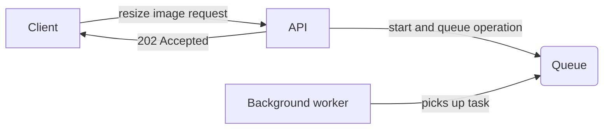

# Geckosoft Images 🦎


Simple web app to upload your images to a web folder. You may then check all of the images' file names, delete an image, resize an image.

## Summary
- [Prerequisites](#-prerequisites)
- [Run the app](#-run-the-app)
- [Description](#-description)
- [REST API](#-rest-api)
	- [Upload a new image](#-upload-a-new-image)
	- [Get all the images](#-get-all-the-images-ordered-by-name)
	- [Delete an image](#-delete-an-image)
	- [Resize an image](#-resize-an-image)

## Prerequisites
Make sure you have the [latest version of .NET](https://dotnet.microsoft.com/en-us/download "latest version of .NET") installed.

On Mac and Windows, trust the HTTPS development certificate by running the following command:

	dotnet dev-certs https --trust

If you're on Linux, see the documentation for your Linux distribution on how to trust the HTTPS development certificate.

## Run the app

The app is ready-to-run, you just need to launch `dotnet run` in project root and you're good to go. Kestrel server is listening on port 7027.

	dotnet run[[1]][REST Api]

Go to `localhost:7027/swagger` to read the OpenAPI documentation and test the endpoints.

# Structure
The application is based upon ASP.NET Core Web API template, with extended support for RESTful HTTP Services, as long as for MVC Controllers. MVC pattern is, of course, the core to the application, and so is dependency injection.

## Background workers
The app can process many requests simultaneously using asynchronous APIs.

Since image processing operations could be time-consuming, **queue** and **background workers** were introduced. The client makes a request and, if validated, gets a 202 Accepted response. Meanwhile, work is being done behind the scenes.



## Persistency

Persistence is provided trough I/O operations.
Uploads are stored under web root folder, specifically at `wwwroot/uploads`.
Web root folder is easily accessible and does not lack privileges to read/write.

## Libraries
- [ImageSharp](https://github.com/SixLabors/ImageSharp "ImageSharp")

The only external library is ImageSharp, provided by SixLabors.
I've started with native image resizing, using `System.Drawing` library, but it is fully compatible on Windows only.
ImageSharp is the fastest cross-platform library in the benchmark according to Six Labors. The use of async methods and the facility of use made the perfect choice for this application.

# REST API

The REST API to the Images app is described below.
The reachable endpoints are `api/images` and `api/images/{name}`.

## Upload a new image

Use `multipart/form-data` to upload a new image. All image file extensions are permitted. (Actually, ALL file extensions are permitted, but 🤫 don't tell my boss!)
You'll get a response indicating `success` and a `data` field with your brand new `fileName`, which will be enchanted with some spicy gibberish magic 🔮, so that your `foo` file will become something like `foo_a1b2`. It will be unique, just like you! 💕

### Request

`POST /api/images`

	curl -X 'POST' \
	'https://localhost:7027/api/images' \
	-H 'accept: application/json' \
	-H 'Content-Type: multipart/form-data' \
	-F 'Image=@foo.jpg;type=image/jpeg'

### Success Response

    HTTP/1.1 200 OK
    Date: Sun, 23 Oct 2022 18:05:38 GMT
    Status: 200 OK
    Content-Type: application/json

    {
    "success": true,
    "data": {
        "fileName": "foo_a1b2"
    }

### Error Response(s)

	HTTP/1.1 422 Unprocessable Entity
	Date: Sun, 23 Oct 2022 18:05:38 GMT
	Status: 422 Unprocessable Entity
	Content-Type: application/json

	{
		"type": "https://tools.ietf.org/html/rfc4918#section-11.2",
		"title": "One or more validation errors occurred.",
		"status": 422,
		"traceId": "00-3239bb21056c7d2a52bccc029c71fd57-eb6d63f288566993-00",
		"errors": {
			"Image": [
				"The Image field is required."
			]
		}
	}

## Get all the images ordered by name

If you did not take notes when uploading your cutie cat images, I've got you covered!
Just reach this endpoint to have a list of all your cat images file names.

### Request

`GET /api/images`

	curl -X 'GET' \
	'https://localhost:7027/api/images' \
	-H 'accept: application/json' \

### Success Response

    HTTP/1.1 200 OK
    Date: Sun, 23 Oct 2022 18:05:38 GMT
    Status: 200 OK
    Content-Type: application/json

	{
	  "success": true,
	  "data": [
		{
		  "fileName": "foo_a1b2"
		},
		{
		  "fileName": "bar_x9y0"
		}
	  ]
	}

## Delete an image

You don't like your cat anymore? Seriously?
Well, no need to panic - tell me the image `name` without extension and your cat is gone.

Trying to delete an image with the same file name but different extension, will result in a Bad Request, sorry!

### Request

`DELETE /api/images/:name`

	curl -X 'DELETE' \
	  'https://localhost:7027/api/images/foo_a1b2' \
	  -H 'accept: application/json'

### Success Response

    HTTP/1.1 200 OK
    Date: Sun, 23 Oct 2022 18:05:38 GMT
    Status: 200 OK
    Content-Type: application/json

	{
	  "success": true,
	  "data": null
	}

### Error Response(s)
```
	HTTP/1.1 400 Bad Request
	Date: Sun, 23 Oct 2022 18:05:38 GMT
	Status: 400 Bad Request
	Content-Type: application/json

	{
	  "success": false,
	  "detail": "More than 1 file with name 'foobar' exists. Cannot handle this request"
	}
```
```
	HTTP/1.1 404 Not Found
	Date: Sun, 23 Oct 2022 18:05:38 GMT
	Status: 404 Not Found
	Content-Type: application/json

	{
	  "success": false,
	  "detail": "Cannot find existing file with name 'foobar'"
	}
```

## Resize an image

Too large? Too small? Fear not, for I am here to rescue you!
Use `width` and `height` as integer values in px as query parameters, so that your cat image will fit your screen purrfectly. 

**Value should be higher than 0!**

Thanks to the power of async/await and background workers, you can send your request and then relax while all the work is done in the background.

Trying to delete an image with the same file name but different extension, will result in a Bad Request, sorry!

### Request

`PUT /api/images/:name?width&height`

	curl -X 'PUT' \
	  'https://localhost:7027/api/images/foo_a1b2?width=50&height=50' \
	  -H 'accept: application/json'

### Success Response

    HTTP/1.1 202 Accepted
    Date: Sun, 23 Oct 2022 18:05:38 GMT
    Status: 202 Accepted

### Error Response(s)

```
	HTTP/1.1 400 Bad Request
	Date: Sun, 23 Oct 2022 18:05:38 GMT
	Status: 400 Bad Request
	Content-Type: application/json

	{
	  "success": false,
	  "detail": "More than 1 file with name 'foobar' exists. Cannot handle this request"
	}
```
```
	HTTP/1.1 404 Not Found
	Date: Sun, 23 Oct 2022 18:05:38 GMT
	Status: 404 Not Found
	Content-Type: application/json

	{
	  "success": false,
	  "detail": "Cannot find existing file with name 'foobar'"
	}
```
```
	HTTP/1.1 422 Unprocessable Entity
	Date: Sun, 23 Oct 2022 18:05:38 GMT
	Status: 422 Unprocessable Entity
	Content-Type: application/json

	{
		"type": "https://tools.ietf.org/html/rfc4918#section-11.2",
		"title": "One or more validation errors occurred.",
		"status": 422,
		"traceId": "00-3239bb21056c7d2a52bccc029c71fd57-eb6d63f288566993-00",
		"errors": {
			"Image": [
				"The Image field is required."
			]
		}
	}
```